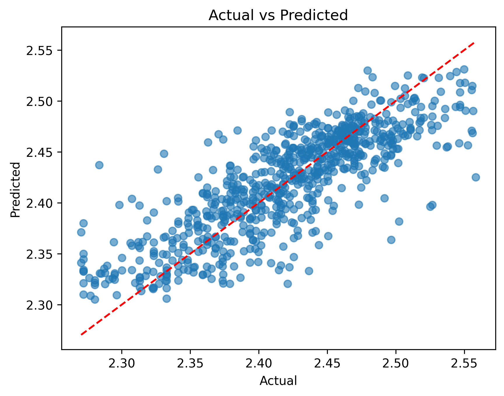

# Used Car Price Prediction

An end-to-end machine learning project for predicting **used car prices** using real-world tabular data.  
The project focuses on **practical data cleaning, feature engineering, and model comparison** rather than purely theoretical modeling.

---

## Project Goal

- Predict used car prices based on vehicle attributes
- Handle noisy, high-cardinality, real-world data
- Compare multiple regression models and evaluate performance

---

## Dataset

- ~4,000 used car listings after cleaning
- Target variable: `price`
- Features include:
  - Mileage, model year, car age
  - Brand, model, transmission, fuel type
  - Engine specifications (parsed from text)
  - Accident history and vehicle condition

---

## Data Processing & Feature Engineering

- **Target transformation**  
  - Applied `log(price)` to handle extreme skew and outliers  
  - This significantly improved model performance

- **Categorical features**
  - Low-cardinality features: One-Hot Encoding
  - High-cardinality features (brand, model, colors): Top-K + `Other`
  - Transmission normalized into semantic categories (Automatic / Manual / CVT)

- **Engine parsing**
  - Extracted structured features from raw text:
    - Engine displacement (liters)
    - Cylinder configuration (I4, V6, V8, etc.)
    - Horsepower (when available)
    - Turbo indicator

---

## Models & Evaluation

Models were evaluated using **5-fold cross-validation (R²)**:

| Model | CV R² (mean ± std) |
|------|------------------|
| Linear Regression | ~0.45 |
| Random Forest Regressor | ~0.67 ± 0.03 |
| XGBoost Regressor | **~0.70 ± 0.03** |

**XGBoost achieved the best overall performance**, showing strong generalization on noisy tabular data.

---

## Prediction Visualization

Actual vs. Predicted values on the test set (log-transformed price):

**Observations:**
- Predictions align well with the ideal `y = x` line
- Mild regression-to-the-mean behavior:
  - Low-priced cars slightly overestimated
  - High-priced cars slightly underestimated
- This behavior is typical for ensemble tree-based models

---

## Key Takeaways

- Log-transforming a skewed target variable is crucial for regression tasks
- Careful handling of high-cardinality categorical features improves stability
- Parsing structured information from text fields is more effective than naive encoding
- Gradient boosting models outperform linear and bagging-based baselines on this task

---

## Tech Stack

- Python
- pandas, numpy
- scikit-learn
- XGBoost
- matplotlib

---

## Project Structure

